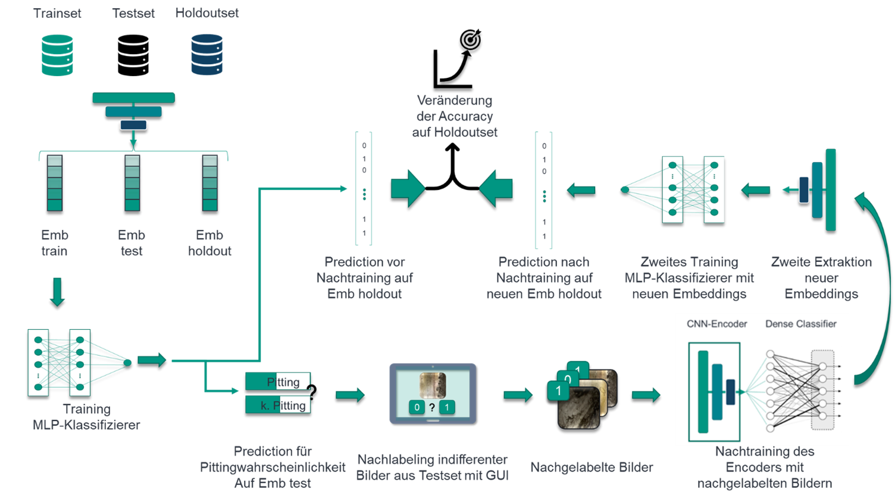

# Online Learning GUI for retraining of pretrained image classificator

### **Overview**
This project presents a graphical user interface for retraining a pretrained binary classification model. The GUI can be further adjusted to more than two classes.

**You can find the corresponding code with all data and models here: https://bwsyncandshare.kit.edu/s/MFb8DN7FYQb8KPS**


Furthermore, a concrete usecase is given for pitting detection of ball screw drives (BSD). The classification task is to decide if a given image has a pitting (1) or not (0). With an unsupervised pretrained Convolutional Base Embeddings for cropped images of BSDs are extracted and classified with an MLP-classifier (*scikit-learn*). The training is conducted on a **trainset** of 10,000 (randomly picked out of 23,717 images (*data_train*)) train images. For a baseline check, 180 images (randomly picked named the **holdoutset**) with new wear and/or soiling patterns (*data_new*) are classfified with this model and accuracy is stored.
In a next step another 180 new images (called the **testset**) are picked from *data_new* and also classified on pittings. All indifferent images (between a classification probability threshold) are relabeled by an expert with the presented GUI. The classification model then is retrained with those relabeled images. Finally, the retrained model classifies the **holdoutset** again and states the improvement (relatively to the first model without retraining)


## Requirements

(Our experiment environment for reference)

* Python 3.7.4
* Tensorflow 2.4.0
* Keras 2.4.3
* opencv-contrib-python 3.4.2.16
* sklearn


## Datasets
This repository provides two datasets:
* **data_train**: 23,717 images cropped out of images of BSDs (53% with pittings (1), 47% without pittings (0))
* **data_new**: 360 cropped images with new and unknown soiling and wear patterns 


## Instructions
This repo shows the example implementation of the presented online learning GUI on an usecase of pitting classification.

The example scripts are as follows:

### Retrain model
To conduct online learning you must run `run_online_learning.py`. If you want to adjust default settings follow the steps below:

Note: As mentioned by default a train and testset for pitting classification of BSDs is provided in this repository
In case you want to use your own dataset you have to change paths for train and new data, respectively (otherwise you can skip this step).

```python
# all train data:
TRAIN_PATH_R = r"/data_bsd/data_train"
# first randomized half of 360 test images
TEST_PATH = r"/data_bsd/test"
# second randomized half of 360 test images
HOLDOUT_PATH = r"/data_bsd/holdout"
# Path for all images trained on 
CURRENT_TRAIN_PATH = r"/data_bsd/current_train_dir"
```

Another variable you can set is the number of samples your model should be trained on.
By default this number is 10,000 samples:
```python
# SET ON HOW MANY TRAIN IMAGES MODEL SHOULD BE TRAINED:
TRAIN_NR = 10000
```

This repo provides an already pretrained model, however you can use your own keras model, too.
All you have to do is to add it to `keras_pretrained_model`:

```python
#%% SET MODEL DIR:
MODELDIR = r'keras_pretrained_model/best_CNN_2-dense-32-nodes-0.6-dropout'
```
The model stated in `MODELDIR` will be used for retraining. Please consider that the model has to be reloaded after each retraining with online learner.

In a last step you can define some hyperparameters for training and retraining.
Furthermore you can dynamically define the threshold of uncertainty for images out of **testset** which should be relabeled (by default: 0.01)

```python
# retrain trained base:
online_learner(CURRENT_TRAIN_PATH, TEST_PATH, HOLDOUT_PATH, trained_embedder=trained_base, threshold=0.05, batch_size=16, dropout=0.6)
```


**NOTE: Due to the high complexitiy of the provided model GPU-usage is highly recommended.**
### Reference

Please kindly cite this paper in your publications if it helps your research:

```
@inproceedings{BSDOnlineLearning,
	title={Online Learning für präventive Verschleißdetektion},
	author={Schlagenhauf, Tobias and Ammann, Nicholas and Fleischer, Juergen},
    booktitle={WTOnline},
	year={2021}
}
```
